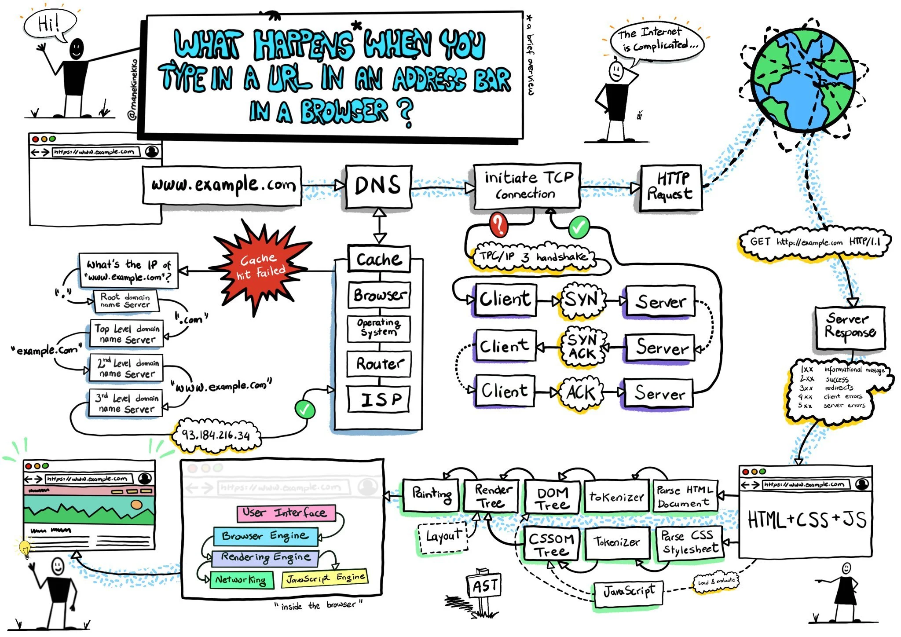
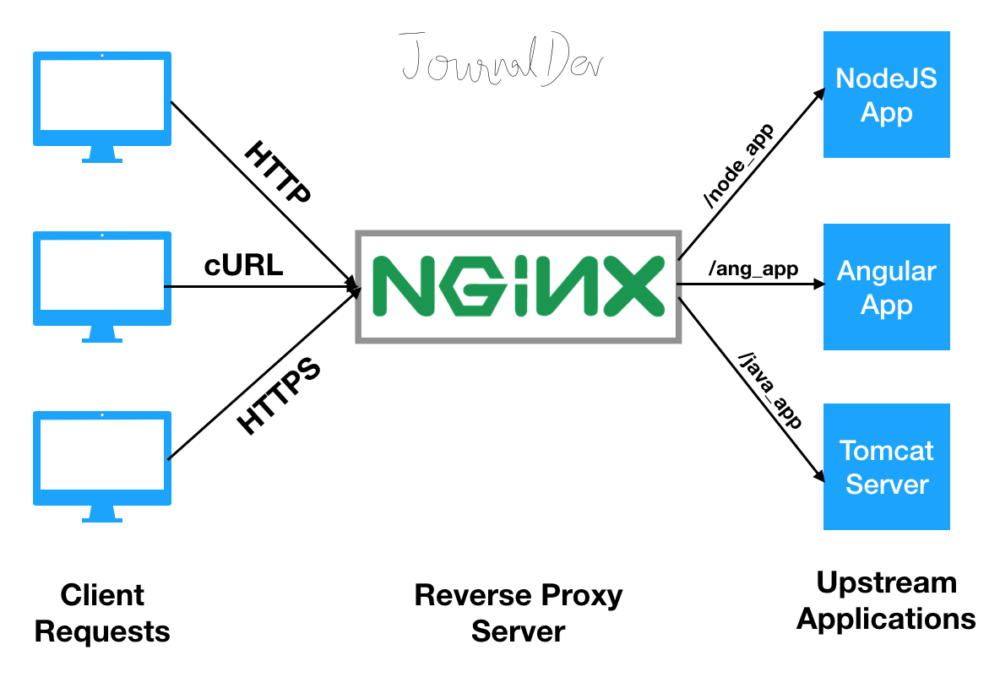
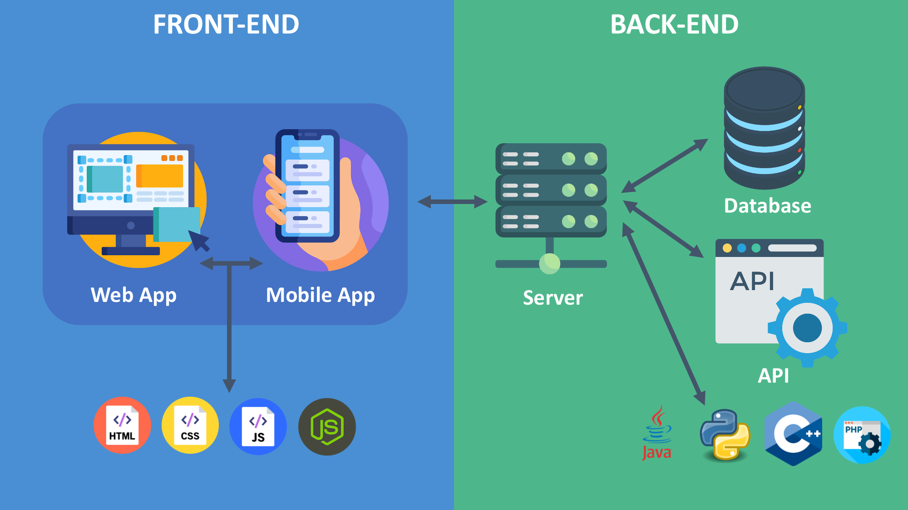

# 🧠 How a Backend Request Travels (From Browser to Database)

---

## Introduction

When we open a website like Instagram or Google, everything feels instant.

But behind the scenes, many systems work together in milliseconds.

In this blog, I will explain in very simple words how a request travels from your browser to the database and back.

---

## 📌 Table of Contents

1. It All Starts in the Browser
2. DNS – The Internet Phonebook
3. Cloud Server & Firewall
4. Nginx – The Traffic Manager
5. Backend Server – The Brain
6. Database – Where Data Lives
7. Why Not Do Everything in Frontend?
8. Final Thoughts

---

## 1️⃣ It All Starts in the Browser

When you type:

```
instagram.com
```

Your browser first checks:

* Browser cache
* System cache

If it doesn’t find the IP address, it contacts DNS.



---

## 2️⃣ DNS – The Internet Phonebook

DNS works like a phonebook for the internet.

It converts:

```
instagram.com → 157.xx.xx.xx
```

Now the browser knows where the server is located.

Without DNS, websites would not work.


---

## 3️⃣ Cloud Server & Firewall

The request now travels through the internet to a cloud provider (like AWS).

Before entering the server:

🔥 The firewall checks:

* Is the request safe?
* Is the IP blocked?
* Is the port allowed?

If everything is okay, the request continues.

---

## 4️⃣ Nginx – The Traffic Manager

Inside the server:

Nginx receives the request first.

It forwards it to the backend application (for example, Node.js running on port 3001).

Nginx helps with:

* Load balancing
* SSL handling
* Traffic management



---

## 5️⃣ Backend Server – The Brain

Now the real logic starts.

Example: You like a post ❤️

Backend will:

* Check if you are logged in
* Verify you didn’t already like the post
* Store the like in the database
* Create a notification
* Send response back

Backend = Decision + Logic + Data Handling

---

## 6️⃣ Database – Where Data Lives

All important data is stored in a database:

* Users
* Posts
* Likes
* Messages

Frontend never directly talks to the database.

Backend acts as the secure middle layer.



---

## 7️⃣ Why Not Do Everything in Frontend?

Simple reasons:

🔐 **Security**
Database passwords cannot be exposed.

🧠 **Business Logic**
Rules must stay protected on the server.

💪 **Heavy Processing**
AI, video processing, and large data tasks need server power.

---

## 8️⃣ Final Thoughts

Backend is not just about creating APIs — it is about architecture, security, scalability, and how different systems communicate with each other.

When we truly understand how a request moves from the browser to the database and back, we start building software more thoughtfully and professionally.

Frontend presents the experience.
Backend powers the experience.

